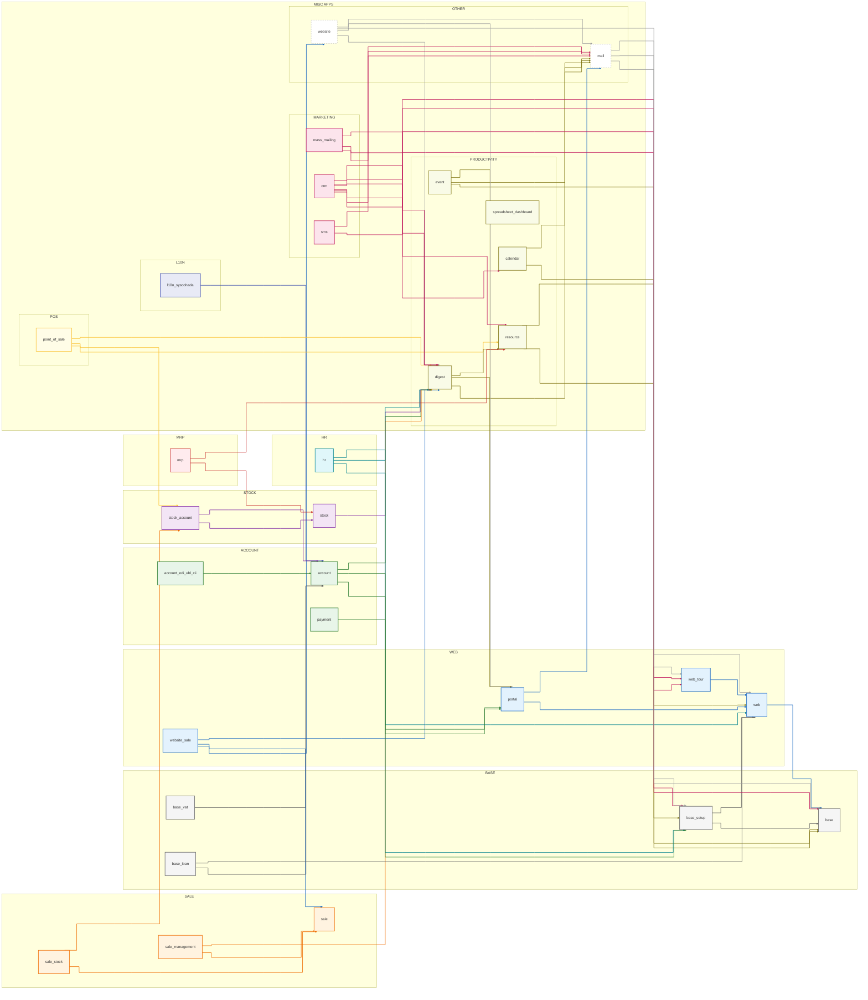

# Module Dependency Analysis

## Top 30 Modules with Most Dependents

| Module | Dependents |
|---|---|
| [`account`](odoo/addons/account) | 149 |
| [`base`](odoo/odoo/addons/base) | 44 |
| [`mail`](odoo/addons/mail) | 43 |
| [`account_edi_ubl_cii`](odoo/addons/account_edi_ubl_cii) | 42 |
| [`base_vat`](odoo/addons/base_vat) | 40 |
| [`web`](odoo/addons/web) | 37 |
| [`point_of_sale`](odoo/addons/point_of_sale) | 36 |
| [`base_iban`](odoo/addons/base_iban) | 25 |
| [`payment`](odoo/addons/payment) | 21 |
| [`sale`](odoo/addons/sale) | 21 |
| [`website`](odoo/addons/website) | 20 |
| [`base_setup`](odoo/addons/base_setup) | 19 |
| [`hr`](odoo/addons/hr) | 18 |
| [`portal`](odoo/addons/portal) | 17 |
| [`sms`](odoo/addons/sms) | 17 |
| [`l10n_syscohada`](odoo/addons/l10n_syscohada) | 17 |
| [`website_sale`](odoo/addons/website_sale) | 16 |
| [`crm`](odoo/addons/crm) | 15 |
| [`digest`](odoo/addons/digest) | 13 |
| [`spreadsheet_dashboard`](odoo/addons/spreadsheet_dashboard) | 13 |
| [`mass_mailing`](odoo/addons/mass_mailing) | 13 |
| [`stock`](odoo/addons/stock) | 11 |
| [`web_tour`](odoo/addons/web_tour) | 10 |
| [`stock_account`](odoo/addons/stock_account) | 10 |
| [`sale_stock`](odoo/addons/sale_stock) | 10 |
| [`mrp`](odoo/addons/mrp) | 10 |
| [`resource`](odoo/addons/resource) | 9 |
| [`calendar`](odoo/addons/calendar) | 9 |
| [`event`](odoo/addons/event) | 9 |
| [`sale_management`](odoo/addons/sale_management) | 9 |

## Likely Base Layers
Modules with many dependents but few dependencies (<= 3).

| Module | Dependents | Dependencies |
|---|---|---|
| [`base`](odoo/odoo/addons/base) | 44 | None |
| [`account_edi_ubl_cii`](odoo/addons/account_edi_ubl_cii) | 42 | [`account`](odoo/addons/account) |
| [`base_vat`](odoo/addons/base_vat) | 40 | [`account`](odoo/addons/account) |
| [`web`](odoo/addons/web) | 37 | [`base`](odoo/odoo/addons/base) |
| [`base_iban`](odoo/addons/base_iban) | 25 | [`account`](odoo/addons/account), [`web`](odoo/addons/web) |
| [`payment`](odoo/addons/payment) | 21 | [`onboarding`](odoo/addons/onboarding), [`portal`](odoo/addons/portal) |
| [`sale`](odoo/addons/sale) | 21 | [`sales_team`](odoo/addons/sales_team), [`account_payment`](odoo/addons/account_payment), [`utm`](odoo/addons/utm) |
| [`base_setup`](odoo/addons/base_setup) | 19 | [`base`](odoo/odoo/addons/base), [`web`](odoo/addons/web) |
| [`l10n_syscohada`](odoo/addons/l10n_syscohada) | 17 | [`account`](odoo/addons/account) |
| [`digest`](odoo/addons/digest) | 13 | [`mail`](odoo/addons/mail), [`portal`](odoo/addons/portal), [`resource`](odoo/addons/resource) |
| [`spreadsheet_dashboard`](odoo/addons/spreadsheet_dashboard) | 13 | [`spreadsheet`](odoo/addons/spreadsheet) |
| [`stock`](odoo/addons/stock) | 11 | [`product`](odoo/addons/product), [`barcodes_gs1_nomenclature`](odoo/addons/barcodes_gs1_nomenclature), [`digest`](odoo/addons/digest) |
| [`web_tour`](odoo/addons/web_tour) | 10 | [`web`](odoo/addons/web) |
| [`stock_account`](odoo/addons/stock_account) | 10 | [`stock`](odoo/addons/stock), [`account`](odoo/addons/account) |
| [`sale_stock`](odoo/addons/sale_stock) | 10 | [`sale`](odoo/addons/sale), [`stock_account`](odoo/addons/stock_account) |
| [`mrp`](odoo/addons/mrp) | 10 | [`product`](odoo/addons/product), [`stock`](odoo/addons/stock), [`resource`](odoo/addons/resource) |
| [`resource`](odoo/addons/resource) | 9 | [`base`](odoo/odoo/addons/base), [`web`](odoo/addons/web) |
| [`calendar`](odoo/addons/calendar) | 9 | [`base`](odoo/odoo/addons/base), [`mail`](odoo/addons/mail) |
| [`sale_management`](odoo/addons/sale_management) | 9 | [`sale`](odoo/addons/sale), [`digest`](odoo/addons/digest) |
| [`utm`](odoo/addons/utm) | 8 | [`base`](odoo/odoo/addons/base), [`web`](odoo/addons/web) |
| [`hr_holidays`](odoo/addons/hr_holidays) | 8 | [`hr`](odoo/addons/hr), [`calendar`](odoo/addons/calendar), [`resource`](odoo/addons/resource) |
| [`html_editor`](odoo/addons/html_editor) | 8 | [`base`](odoo/odoo/addons/base), [`bus`](odoo/addons/bus), [`web`](odoo/addons/web) |
| [`l10n_gcc_invoice`](odoo/addons/l10n_gcc_invoice) | 8 | [`account`](odoo/addons/account) |
| [`l10n_din5008`](odoo/addons/l10n_din5008) | 8 | [`account`](odoo/addons/account) |
| [`account_debit_note`](odoo/addons/account_debit_note) | 8 | [`account`](odoo/addons/account) |
| [`contacts`](odoo/addons/contacts) | 7 | [`base`](odoo/odoo/addons/base), [`mail`](odoo/addons/mail) |
| [`iap_mail`](odoo/addons/iap_mail) | 7 | [`iap`](odoo/addons/iap), [`mail`](odoo/addons/mail) |
| [`l10n_latam_base`](odoo/addons/l10n_latam_base) | 7 | [`contacts`](odoo/addons/contacts), [`base_vat`](odoo/addons/base_vat) |
| [`pos_restaurant`](odoo/addons/pos_restaurant) | 7 | [`point_of_sale`](odoo/addons/point_of_sale) |
| [`purchase`](odoo/addons/purchase) | 7 | [`account`](odoo/addons/account) |
| [`purchase_stock`](odoo/addons/purchase_stock) | 7 | [`stock_account`](odoo/addons/stock_account), [`purchase`](odoo/addons/purchase) |
| [`mass_mailing_sms`](odoo/addons/mass_mailing_sms) | 7 | [`portal`](odoo/addons/portal), [`mass_mailing`](odoo/addons/mass_mailing), [`sms`](odoo/addons/sms) |
| [`pos_self_order`](odoo/addons/pos_self_order) | 7 | [`pos_restaurant`](odoo/addons/pos_restaurant), [`http_routing`](odoo/addons/http_routing), [`link_tracker`](odoo/addons/link_tracker) |
| [`auth_signup`](odoo/addons/auth_signup) | 6 | [`base_setup`](odoo/addons/base_setup), [`mail`](odoo/addons/mail), [`web`](odoo/addons/web) |
| [`phone_validation`](odoo/addons/phone_validation) | 6 | [`base`](odoo/odoo/addons/base), [`mail`](odoo/addons/mail) |
| [`event_sale`](odoo/addons/event_sale) | 6 | [`event_product`](odoo/addons/event_product), [`sale_management`](odoo/addons/sale_management) |

## Core Dependency Backbone (Mermaid)

